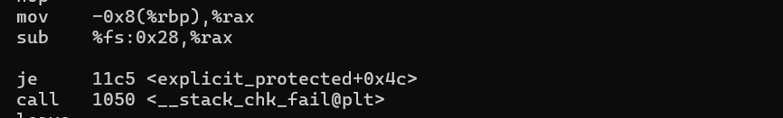

# Stack Canaries Observations: Which Functions Are Considered Risky?

## 1. Introduction
So far, I explored the behavior of [NX](https://github.com/mio-mio/nx-observation/blob/main/README.md), [ASLR](https://github.com/mio-mio/aslr/blob/main/README.md), and [PIE](https://github.com/mio-mio/pie/blob/main/README.md). These are defenses that make exploitation less reliable.

However, stack canaries take a different approach. They detect memory corruption before control flow is hijacked.

Stack canaries can be enabled at compile time, but depending on compiler options, they may be inserted into some functions but not others.

I learned that this decision is often based on heuristics.
This made me wonder: what kinds of functions are actually protected?

## 2. What Stack Canaries Actually Do
Stack canaries are values inserted into the stack frame before control data such as the return address is stored.

When a buffer overflow occurs, these values may also be overwritten. If the value changes, the program detects the corruption and terminates execution.

There are three commonly discussed types of stack canaries: terminator canaries, random canaries, and random XOR canaries.

Among these, random canaries are the most commonly used on modern systems, and this experiment focuses on observing their behavior.

Here, I changed compiler options and observed how stack canaries behave across multiple functions.

## 3. Experiment Setup
I compiled a C program with different stack protector options and compared the results across functions with different characteristics.

The tested functions included:
- character arrays (small and large)
- integer arrays
- pointer variables
- local structures
- use of strcpy()
- simple local integer variables
- simple arithmetic operations
- global variable only
- heap only
- never called by main function

Canary-related instructions can be observed in the generated assembly code, as shown below:

Before running the experiment, I made several predictions.

- I expected functions using pointers or with large buffers to be consistently protected by stack canaries.
- I also expected that character arrays and integer arrays would more likely be protected with `-fstack-protector-strong`.
- At the same time, I thought some functions using local structures, simple local integer variables, simple arithmetic operations, global variable only and heap only might not always trigger protection unless `-fstack-protector-all` was used.

For additional curiosity, I also included a function that is never called from main().

## 4. Observations
The experimental results are shown below:
| Function | protector | strong | all |
|---|---|---|---|
| char_array_small | No | yes | yes |
| char_array_large | yes | yes | yes |
| int_array | No | yes | yes |
| pointer_only | No | yes | yes |
| local_struct | yes | yes | yes |
| uses_strcpy | yes | yes | yes |
| simple_local_int | no | no | yes |
| simple_math | no | no | yes |
| global_only | no | no | yes |
| heap_only | no | no | yes |
| never_called | yes | yes | yes |

I learned that stack canary insertion is determined heuristically, and these results revealed several interesting patterns:

- Small character arrays, integer arrays, and pointer-related functions showed similar protection behavior under `-fstack-protector-strong`.
- As I expected, simple local integer, simple math, global-only, and heap-only functions were not protected unless `-fstack-protector-all` was used, suggesting they are not considered sufficiently risky by the default heuristics.
- Interestingly, the function that is never called by the main() always had the canary protection.

## 4.1. `-fstack-protector-explicit` experiment
During this research, I noticed another option called `-fstack-protector-explicit`. According to the official document, it only protects the functions with `stack_protect` attribute.

I compiled the program using this option as well and observed the results. The functions with `stack_protect` attribute were protected, and other functions did not receive canary protection. 

Compared to the heuristic-based options, this approach felt much more explicit and predictable. But I wondered when we need this option.

One possible use case is performance-sensitive systems such as IoT devices, firmware, or microcontrollers. When stack canaries work, overhead happens. Most laptop users would not notice this overhead much, but for performance-sensitive systems, it could be a big difference. This option allows developers to explicitly control which functions are protected.

## 4.2. main() without buffer
Initially, this experiment only involved multiple functions inside main() and it was not protected by a stack canary. I thought this was normal behavior at first. 

However, after adding a local character buffer (`char buf[32]`), stack canary protection was inserted into main() as well.

## 5. Key Insight
- I learned that GCC heuristics may consider buffer size when deciding whether to insert stack canaries.
- From what I observed, `-fstack-protector-strong` appears to behave similarly to `-fstack-protector-all` in many practical cases.
- Result of `-fstack-protector-explicit` was very different from other options, but it is clearly useful in specific environments.

## 6. Conclusion
This experiment helped me better understand which kinds of functions are considered risky by GCC heuristics.

I started exploring defense mechanisms to better understand how modern systems protect themselves. Through this experiment, I also became more aware of environments such as firmware and IoT systems, which previously felt far removed from my learning.

I would like to continue exploring low-level security mechanisms and mitigation techniques in future experiments.

## References

- GCC documentation: Instrumentation Options

## Source Files

- Source code used in this experiment: `canary_demo.c`
- Compilation script: `compile.sh`
